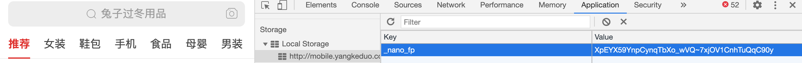
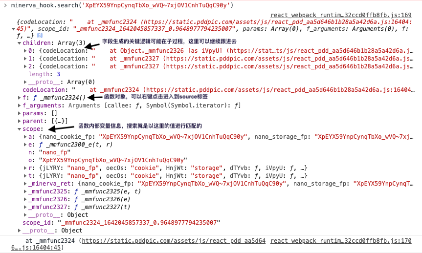
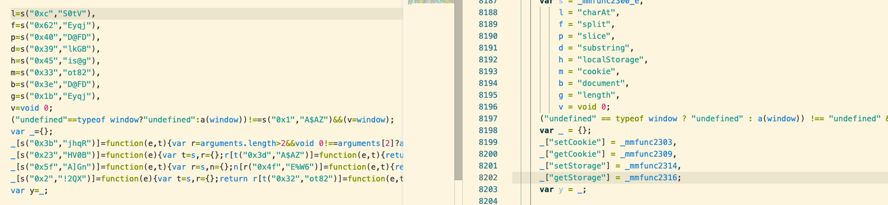
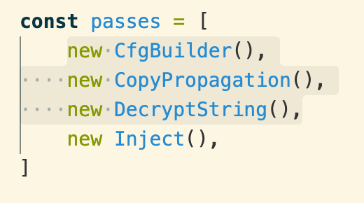

## Minerva-js介绍
主要目标提高js逆向效率

## 功能点
1.快速定位加密字段生成函数

2.代码反混淆(持续增加中...)

3.TODO:目标函数二次优化(可继续逆向逻辑，或直接丢进VM执行)

## 使用介绍
### 1.项目启动
1).项目根目录执行：
```
npm install
npm run minerva
```

注: 第一次运行需要装一下AnyProxy证书，详见:https://github.com/alibaba/anyproxy/wiki/v3.x--HTTPS%E7%9B%B8%E5%85%B3%E6%95%99%E7%A8%8B

2).把浏览器代理指向localhost:10086 (可以用chrome插件：SwitchyOmega)

3).浏览器打开目标网站，开始分析

### 2.快速定位加密字段生成函数
#### 使用方法:
比如这里我们想要分析拼多多nano_fp字段怎么生成的

直接在console里执行：
```
minerva_hook.search('XpEYX59YnpCynqTbXo_wVQ~7xjOV1CnhTuQqC90y')
```
得到结果:


#### 原理简介：
Ast分析阶段最后一个步骤，会给每个函数开始和结束部分插入hook代码，程序执行的时候会执行hook代码将函数scope保存起来
目前只打印第一个匹配到的结果,一般来说根据children节点跟进就够用了，如果需要打印所有结果可以这样调：
```
minerva_hook.search('XpEYX59YnpCynqTbXo_wVQ~7xjOV1CnhTuQqC90y',false)
```

### 3.代码反混淆
默认情况代码已经自动反混淆了，pdd样本对比：


现在反混淆还比较慢，如果需要关闭，可以注释src/components/pass/pass-manager.ts文件passes数组反混淆相关pass：
